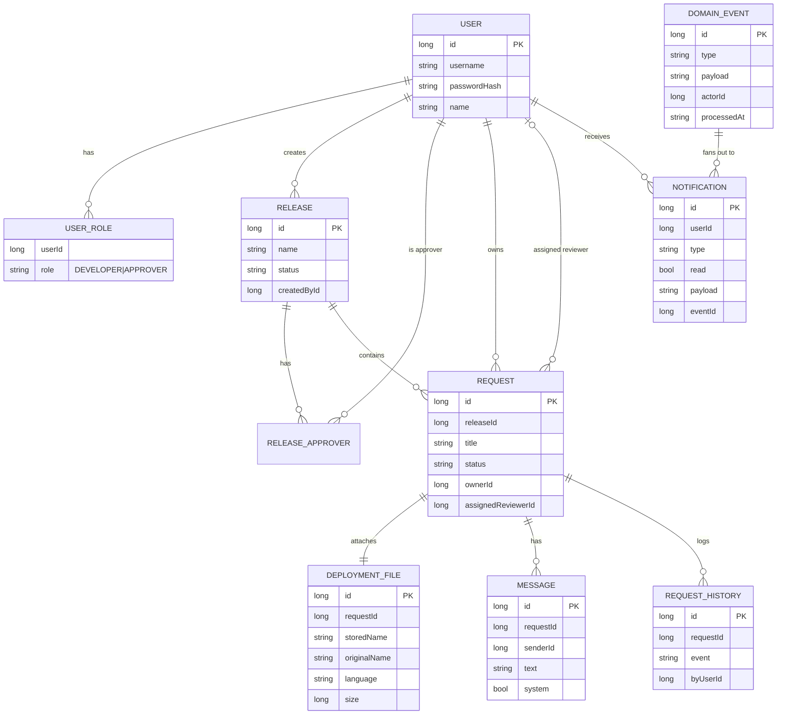

# Deployment Approval Portal — API Guide

**Version:** 1.2
**Audience:** Backend + Frontend hackathon team
**Base URL:** `http://localhost:8080`
**API prefix:** `/api`
**Content-Type:** `application/json` (except file upload endpoints, which use `multipart/form-data`)

> **Provenance:** this file is a verbatim copy of the BE contract as handed to the FE team. It is the single source of truth for everything under [docs/frontend/](frontend/00-overview.md). If the contract changes, update it here first, then update the FE docs that depend on it.

This is the single source of truth for the API contract. FE and BE both follow this. If something must change, change it **here first**, then implement.

---

## 0. Conventions

### Auth model (hackathon simplification)
- Users are **hardcoded** on the backend (see [§2 Users](#2-users--auth)).
- Login takes a `username` + `password`, returns a **bearer token**.
- Every protected request sends `Authorization: Bearer <token>`.
- The token encodes `userId` + `role`. BE resolves the current user from the token — FE never sends `userId` in the body.

### Roles
| Role | Can do |
|------|--------|
| `DEVELOPER` | Create/edit their own requests, submit for approval, chat on their requests, download their own scripts |
| `APPROVER` | Create releases, add approvers, review requests (approve/reject/request changes), chat, download scripts |

**A user can hold BOTH roles simultaneously.** `roles` is a **set**, not a single value. Consequences:
- Every permission check is a **capability check** ("does the caller have the DEVELOPER role?"), never an identity check ("is the caller a developer?"). Write your auth guards that way from day one.
- A dual-role user gets the **union** of both dashboards and both notification streams (deduplicated — one event, one notification).
- **Self-review is forbidden, always**: a user can never `review/start`, approve, reject, or request changes on a request they own, regardless of roles → `403 SELF_REVIEW_FORBIDDEN`. An approval portal where you can approve your own script is worthless — this is the first thing a judge will try.

### Generic CRUD controller (`AbstractCrudController<E,ID,C,U,R>`)
This project already has a common CRUD base (`common/crud/AbstractCrudController.kt` + `AbstractCrudService.kt`) — reuse it, don't reinvent. Every entity below is built the same way: entity extends `CrudBaseEntity`, is annotated `@AutoCrud(create=.., read=.., update=.., delete=.., pageable=.., interceptor=XxxCrudInterceptor::class)`, and gets a thin controller subclass mounted at `/api/{entity}`:
```kotlin
@RestController
@RequestMapping("/api/notifications")
class NotificationController(service: NotificationService) :
    AbstractCrudController<NotificationEntity, Long, NotificationCreateDto, NotificationUpdateDto, NotificationReadDto>(service, NotificationEntity::class)
```
Standard verbs it gives you for free: `POST /api/{entity}` · `GET /api/{entity}/{id}` · `PUT /api/{entity}/{id}` · `DELETE /api/{entity}/{id}` (soft delete — sets `status=DELETED`, per `CrudBaseEntity`) · `GET /api/{entity}` (paged) · `GET /api/{entity}/count`.

**Visibility and invariants are enforced via `@AutoCrud` flags + a `CrudInterceptor` — not by avoiding the controller.** The interceptor's `canRead`/`canWrite` hooks are exactly where our access rules (draft-hiding, locked requests, self-review, own-notifications-only) belong.

| Entity | `@AutoCrud` flags | Interceptor rule |
|--------|------------------|-------------------|
| `users` | `read=true, pageable=true` (rest `false`) | none — but `UserReadDto` must omit password |
| `notifications` | `read=true, update=true, pageable=true` (rest `false`) | `canRead`/`canWrite`: row's `userId == currentUser.id`, else `AppException(ACCESS_DENIED)`. `update` is only ever the mark-read field (§7) |
| `releases` | `read=true, pageable=true` (rest `false`) | `canRead`: any authenticated user |
| `deployment_requests` | `read=true, pageable=true` (rest `false`) | `canRead`: implements the full visibility matrix (§4) — owner, or release approver with locked-check, else drafts/locked rows excluded from `getAll` and 404 from `read` |
| `deployment_request_messages`, `deployment_files`, `domain_events`, `*_history` | all `false` | No generic endpoint at all — mutate only via §4/§5 lifecycle endpoints, which call the service layer directly (not through the CRUD controller) |

**The rule in one line:** `create/update/delete` stay `false` in `@AutoCrud` for every entity whose state machine matters (`releases`, `deployment_requests`). A generic `PUT /api/deployment-requests/42 {"status":"APPROVED"}` would bypass the state machine, the atomic decision check, the audit trail, and the notification fan-out — all four at once — so that flag is off and those mutations only exist as the named lifecycle endpoints in §3/§4/§5, which call `AbstractCrudService`'s underlying repository/service directly rather than exposing it through the generic controller.

### Standard error shape
Matches this repo's existing `ErrorResponse` (`common/dto/ErrorResponse.kt`) — every 4xx/5xx returns:
```json
{
  "code": "REQUEST_LOCKED",
  "message": "This request is restricted to Dan Approver for review.",
  "status": 403,
  "timestamp": "2026-07-16T10:20:30Z"
}
```
`message` is for humans; **`code` is for the FE**. Never branch UI logic on message text. New codes below (`RELEASE_NOT_OPEN`, `SELF_REVIEW_FORBIDDEN`, etc.) are added as new `AppError` entries alongside the existing `UNAUTHORIZED`/`ACCESS_DENIED`.

#### Error code catalog
| code | HTTP | When |
|------|------|------|
| `INVALID_CREDENTIALS` | 401 | Bad login |
| `VALIDATION_FAILED` | 400 | Any field/file validation error (details in `message`) |
| `RELEASE_NOT_OPEN` | 409 | Creating/submitting a request against a non-OPEN release |
| `RELEASE_HAS_OPEN_REQUESTS` | 409 | Moving release to READY_FOR_DEPLOYMENT with undecided requests |
| `REQUEST_LOCKED` | 403 | Approver opening a request restricted to another reviewer |
| `REQUEST_NOT_EDITABLE` | 409 | Editing a request that is not DRAFT / CHANGES_REQUESTED |
| `REQUEST_NOT_REVIEWABLE` | 409 | Decision on a request not in PENDING_APPROVAL |
| `REQUEST_ALREADY_DECIDED` | 409 | Second approver decides after the first already did |
| `NOT_RELEASE_APPROVER` | 403 | Approver acting on a release they are not a member of |
| `SELF_REVIEW_FORBIDDEN` | 403 | Dual-role user attempting to review/decide their **own** request |
| `NOT_FOUND` | 404 | Missing resource — or one whose existence must not leak (others' drafts) |

### Validation limits (enforced by BE, mirrored by FE)
| Field | Limit |
|-------|-------|
| release `name` | 1–100 chars, unique |
| request `title` | 1–150 chars |
| request `description` | 1–5000 chars |
| message `text` | 1–2000 chars |
| script file | extensions `py` / `js` / `sh`; 1 byte – 5 MB |

### Pagination (lists)
Generic-CRUD `GET /api/{entity}` endpoints use Spring's standard `Pageable` — `?page=0&size=20&sort=createdAt,desc` — and return a `Page<R>` (`content`, `totalElements`, `number`, `size`, ...). Custom lifecycle list endpoints (e.g. `GET /api/releases/{id}/requests`) return a plain JSON array for hackathon scope, matching §6 below.

### Standard success wrappers
- Single object: the DTO (`R`) returned directly as JSON — no envelope, matching `AbstractCrudController`.
- Lists via generic CRUD: `Page<R>` as above. Lists via custom endpoints: a plain JSON array.

### ID convention
- All IDs are `Long` (numeric). Timestamps are ISO-8601 UTC strings (`2026-07-16T10:20:30Z`).

### HTTP status codes used
`200` OK · `201` Created · `204` No Content · `400` Bad Request · `401` Unauthorized · `403` Forbidden · `404` Not Found · `409` Conflict.

---

## 1. Enums & State Machines

### Release status
```
OPEN ⇄ READY_FOR_DEPLOYMENT → CLOSED
```
| Transition | Guard |
|-----------|-------|
| `OPEN → READY_FOR_DEPLOYMENT` | **No request in the release may be `PENDING_APPROVAL` or `CHANGES_REQUESTED`** — else `409 RELEASE_HAS_OPEN_REQUESTS`. Drafts may still exist (they just can no longer be submitted). |
| `READY_FOR_DEPLOYMENT → OPEN` | Allowed (re-open the cycle). |
| `READY_FOR_DEPLOYMENT → CLOSED` | Allowed. **Terminal** — a CLOSED release never changes again. |
| `OPEN → CLOSED` | Not allowed — go through READY_FOR_DEPLOYMENT. |

Requests can only be **created or submitted** against `OPEN` releases (`409 RELEASE_NOT_OPEN`).

### Request (deployment request) status
```
DRAFT ──submit──► PENDING_APPROVAL ──approve──► APPROVED   (terminal)
                     │        │
                     │        └──reject──► REJECTED        (terminal)
                     │
                     └──request_changes──► CHANGES_REQUESTED
                                               │
                        (editable again) ──resubmit──► PENDING_APPROVAL
```

**Hard rules — read twice:**
1. Decisions (`approve` / `reject` / `request-changes`) are only valid from `PENDING_APPROVAL`. A request in `CHANGES_REQUESTED` **cannot be approved directly** — the developer may be mid-edit on the file, and approving it would approve a script nobody reviewed. It must be resubmitted first.
2. `APPROVED` and `REJECTED` are **terminal**. A rejected script comes back as a **new request** (fresh review, fresh conversation) — no resurrection.
3. Decisions are **atomic, first-write-wins**: if two approvers act simultaneously, the second gets `409 REQUEST_ALREADY_DECIDED`. BE enforces this with a single conditional UPDATE (status precondition), never read-then-write.
4. Editing (`PATCH`, file replace) is only valid in `DRAFT` / `CHANGES_REQUESTED` → `409 REQUEST_NOT_EDITABLE` otherwise.

| Status | Visible to approvers? | Meaning |
|--------|----------------------|---------|
| `DRAFT` | ❌ No | Developer still editing. Only the owner sees it. |
| `PENDING_APPROVAL` | ✅ Yes | Awaiting an approver's decision. |
| `CHANGES_REQUESTED` | ✅ Yes | Approver asked for changes; ball is in developer's court. |
| `APPROVED` | ✅ Yes | Terminal-ish (final for release). |
| `REJECTED` | ✅ Yes | Terminal. |

**Note:** There is intentionally **no `REVIEW_IN_PROGRESS`** status. "X is reviewing" is a **real-time ephemeral signal only** (see [§8](#8-real-time-websocket-layer)), not a persisted request state.

### Reviewer restriction
A request may optionally target a **specific reviewer** (`assignedReviewerId`).
- If set: only that approver (and the developer owner) can **open / review / chat**. Other approvers **see it in the list** but get `403` on open, with a friendly message.
- If null: any approver on the release can open/review/chat.

### Data model (ERD)


**Physical table names** (agree once, stop bikeshedding):
`users`, `user_roles`, `releases`, `release_approvers`, `deployment_requests`, `deployment_files`, `deployment_request_messages`, `deployment_request_history`, `notifications`, `domain_events`.

`domain_events` is the **transactional outbox** — see §8 event pipeline. `deployment_request_history` and `domain_events` are append-only.

---

## 2. Users & Auth

### Hardcoded users (seed data)
> BE seeds these on startup. Passwords are plaintext for the hackathon only.

| id | username | password | roles | name |
|----|----------|----------|-------|------|
| 1 | `dev1` | `dev123` | DEVELOPER | Alice Dev |
| 2 | `dev2` | `dev123` | DEVELOPER | Bob Dev |
| 3 | `approver1` | `appr123` | APPROVER | Carol Approver |
| 4 | `approver2` | `appr123` | APPROVER | Dan Approver |
| 5 | `lead1` | `lead123` | DEVELOPER, APPROVER | Eve Lead |

User 5 exists **specifically to test the dual-role rules** (union dashboard, self-review block, notification dedup). Demo with it.

### `POST /api/auth/login`
Auth: **public**

Request:
```json
{ "username": "dev1", "password": "dev123" }
```
Response `200`:
```json
{
  "token": "eyJhbGciOi...",
  "user": { "id": 1, "username": "dev1", "name": "Alice Dev", "roles": ["DEVELOPER"] }
}
```
Errors: `401` on bad credentials.

### `GET /api/auth/me`
Auth: **any logged-in user**

Response `200`:
```json
{ "id": 1, "username": "dev1", "name": "Alice Dev", "roles": ["DEVELOPER"] }
```

### `GET /api/users?role=APPROVER`
Auth: **any logged-in user** (used when an approver picks other approvers to add, or a developer picks a specific reviewer).

Query params: `role` (optional) — `DEVELOPER` | `APPROVER`. Matches users **having** that role (a dual-role user appears in both filters).

Response `200`:
```json
[
  { "id": 3, "username": "approver1", "name": "Carol Approver", "roles": ["APPROVER"] },
  { "id": 4, "username": "approver2", "name": "Dan Approver", "roles": ["APPROVER"] },
  { "id": 5, "username": "lead1", "name": "Eve Lead", "roles": ["DEVELOPER", "APPROVER"] }
]
```

---

## 3. Releases

### `POST /api/releases`
Auth: **APPROVER**. Creator is auto-added as an approver on the release.

Request:
```json
{
  "name": "Release 2026.07",
  "description": "July deployment cycle",
  "status": "OPEN",
  "approverIds": [4]
}
```
- `status` optional, defaults to `OPEN`.
- `approverIds` optional — additional approvers besides the creator.

Response `201`:
```json
{
  "id": 10,
  "name": "Release 2026.07",
  "description": "July deployment cycle",
  "status": "OPEN",
  "createdBy": { "id": 3, "name": "Carol Approver" },
  "approvers": [
    { "id": 3, "name": "Carol Approver" },
    { "id": 4, "name": "Dan Approver" }
  ],
  "requestCount": 0,
  "createdAt": "2026-07-16T10:00:00Z"
}
```
**Side effect:** Notifies **all developers** (see [§8 event `RELEASE_CREATED`](#event-catalog)).

### `GET /api/releases`
Auth: **any**. Role-aware dashboard list.
- **Developers:** see all releases (they need to know where to submit).
- **Approvers:** see all releases.

Query params (optional): `status=OPEN`.

Response `200`:
```json
[
  {
    "id": 10,
    "name": "Release 2026.07",
    "status": "OPEN",
    "createdBy": { "id": 3, "name": "Carol Approver" },
    "approvers": [ { "id": 3, "name": "Carol Approver" } ],
    "requestCount": 5,
    "myRequestCount": 2,
    "createdAt": "2026-07-16T10:00:00Z"
  }
]
```
- `requestCount`: total visible requests to this user in the release.
- `myRequestCount`: developer's own requests (present for developers; approvers can ignore).

### `GET /api/releases/{id}`
Auth: **any**. Full detail (same shape as create response + approvers list).

### `PATCH /api/releases/{id}/status`
Auth: **APPROVER on the release**.

Request:
```json
{ "status": "READY_FOR_DEPLOYMENT" }
```
Response `200`: updated release.

### `POST /api/releases/{id}/approvers`
Auth: **APPROVER on the release**.

Request:
```json
{ "approverIds": [4] }
```
Response `200`: updated release with new approvers list.
**Side effect:** notifies newly added approvers (`ADDED_AS_APPROVER`).

### `DELETE /api/releases/{id}/approvers/{userId}` *(optional)*
Auth: **APPROVER on the release**. Removes an approver. Response `204`.

---

## 4. Deployment Requests

A request belongs to exactly one release, has a description and one attached script file.

### `POST /api/releases/{releaseId}/requests`
Auth: **DEVELOPER**. `Content-Type: multipart/form-data`.

Form fields:
| field | type | required | notes |
|-------|------|----------|-------|
| `title` | text | yes | Short title |
| `description` | text | yes | What the script does |
| `assignedReviewerId` | text (number) | no | Restrict review to one approver |
| `status` | text | no | `DRAFT` (default) or `PENDING_APPROVAL` |
| `file` | file | yes | Script: `.py`, `.js`, `.sh` |

Response `201`:
```json
{
  "id": 42,
  "releaseId": 10,
  "title": "Migrate user table",
  "description": "Adds nullable column",
  "status": "DRAFT",
  "owner": { "id": 1, "name": "Alice Dev" },
  "assignedReviewer": null,
  "file": { "name": "migrate.py", "size": 2048, "language": "python" },
  "reviewingBy": null,
  "createdAt": "2026-07-16T10:05:00Z",
  "updatedAt": "2026-07-16T10:05:00Z"
}
```
Rules:
- Release must be `OPEN` → else `409 RELEASE_NOT_OPEN`.
- File: extensions `py` / `js` / `sh`, non-empty, ≤ 5 MB → else `400 VALIDATION_FAILED`.
- If created directly as `PENDING_APPROVAL`, fires `REQUEST_SUBMITTED` (notifies approvers). If `DRAFT`, no approver notification.

### `GET /api/releases/{releaseId}/requests`
Auth: **any**. Role-aware list.
- **Developer:** only **their own** requests (including their drafts).
- **Approver:** all requests in the release **except other developers' drafts**. Restricted requests (with an `assignedReviewerId` not equal to this approver) appear but are marked locked.
- **Dual-role:** the union — all non-draft requests **plus** their own drafts. Their own requests carry `"mine": true` so FE can hide review buttons on them (`SELF_REVIEW_FORBIDDEN` backs this server-side).

Response `200`:
```json
[
  {
    "id": 42,
    "title": "Migrate user table",
    "status": "PENDING_APPROVAL",
    "owner": { "id": 1, "name": "Alice Dev" },
    "assignedReviewer": { "id": 3, "name": "Carol Approver" },
    "locked": false,
    "reviewingBy": null,
    "unreadMessages": 0,
    "createdAt": "2026-07-16T10:05:00Z"
  },
  {
    "id": 43,
    "title": "Purge cache",
    "status": "PENDING_APPROVAL",
    "owner": { "id": 2, "name": "Bob Dev" },
    "assignedReviewer": { "id": 4, "name": "Dan Approver" },
    "locked": true,
    "reviewingBy": null,
    "createdAt": "2026-07-16T10:06:00Z"
  }
]
```
- `locked`: `true` when the current approver is **not** allowed to open (restricted to someone else). FE greys it out.

### `GET /api/requests/{id}`
Auth: **owner developer** OR **approver allowed to open**.
- If restricted to another reviewer → `403 REQUEST_LOCKED` with message `"This request is restricted to <name> for review."`
- If it's another developer's draft → `404 NOT_FOUND` — drafts must not leak their existence (a `403` confirms the request exists).

Response `200`: full request object (same shape as create response) **plus** `release` summary.

**Side effect (info signal):** if an approver opens a request that someone else is currently reviewing, BE responds normally but includes:
```json
{ "reviewingBy": { "id": 4, "name": "Dan Approver" } }
```
FE shows an info banner: *"Dan Approver is currently reviewing this request."* Opening is **not** blocked.

### `PATCH /api/requests/{id}`
Auth: **owner developer**, only while status is `DRAFT` or `CHANGES_REQUESTED`.

Request (any subset):
```json
{ "title": "New title", "description": "Updated", "assignedReviewerId": 3 }
```
Response `200`: updated request. `assignedReviewerId: null` clears the reviewer restriction.

### `DELETE /api/requests/{id}`
Auth: **owner developer**, only while `DRAFT`. Response `204`.
Non-draft requests are part of the audit trail and can **never** be deleted.

### `PUT /api/requests/{id}/file`
Auth: **owner developer**, while `DRAFT` or `CHANGES_REQUESTED`. `multipart/form-data`, field `file`. Replaces the attached script. Response `200`.

### `POST /api/requests/{id}/submit`
Auth: **owner developer**. Transitions `DRAFT` or `CHANGES_REQUESTED` → `PENDING_APPROVAL`.
Response `200`: updated request.
**Side effect:** `REQUEST_SUBMITTED` → notifies eligible approver(s). If restricted, only the assigned reviewer is notified.

### `GET /api/requests/{id}/file`
Auth: **owner developer** OR **approver allowed to open**.
Response `200`: the raw file bytes.
```
Content-Type: application/octet-stream
Content-Disposition: attachment; filename="migrate.py"
```
FE renders this as a **download button**.
Storage rule: save uploads under a **server-generated name** (UUID) and keep the original filename as metadata only — never build filesystem paths from user input (path traversal). Sanitize the filename in `Content-Disposition`.

### `GET /api/requests/{id}/history`
Auth: same visibility rules as opening the request. The audit trail every approval tool needs — who did what, when.
Response `200`:
```json
[
  { "at": "2026-07-16T10:05:00Z", "by": { "id": 1, "name": "Alice Dev" }, "event": "CREATED" },
  { "at": "2026-07-16T10:07:00Z", "by": { "id": 1, "name": "Alice Dev" }, "event": "SUBMITTED" },
  { "at": "2026-07-16T10:11:00Z", "by": { "id": 3, "name": "Carol Approver" }, "event": "CHANGES_REQUESTED" },
  { "at": "2026-07-16T10:18:00Z", "by": { "id": 1, "name": "Alice Dev" }, "event": "FILE_REPLACED" },
  { "at": "2026-07-16T10:20:00Z", "by": { "id": 1, "name": "Alice Dev" }, "event": "RESUBMITTED" }
]
```
BE appends a history row inside the same transaction as every state change and file replacement. This is cheap to build and disproportionately impressive to judges.

### Review actions (APPROVER **on the release** only — `403 NOT_RELEASE_APPROVER` otherwise — and must be allowed to open)

> **Self-review guard on all four actions below**: if the caller is the request's owner — possible now that a user can hold both roles — every review action returns `403 SELF_REVIEW_FORBIDDEN`. Check ownership **before** role.

#### `POST /api/requests/{id}/review/start`
Marks that this approver has started reviewing. **Ephemeral** — no status change on the request.
Response `200`:
```json
{ "requestId": 42, "reviewingBy": { "id": 3, "name": "Carol Approver" } }
```
**Side effect:** broadcasts `REQUEST_REVIEW_STARTED` to other approvers' dashboards → they see *"Carol Approver is reviewing."* Does not lock the request.

Optional companion: `POST /api/requests/{id}/review/stop` clears the reviewing flag (also emitted automatically on approve/reject/request-changes or after a timeout).

#### `POST /api/requests/{id}/approve`
Transitions `PENDING_APPROVAL` → `APPROVED`. Only from `PENDING_APPROVAL` — see §1 hard rules.
Request (optional): `{ "comment": "LGTM" }` — added as a conversation message if present.
Response `200`: updated request.
**Side effect:** `REQUEST_APPROVED` → notifies the developer owner.

#### `POST /api/requests/{id}/reject`
`PENDING_APPROVAL` → `REJECTED` (terminal). Request: `{ "comment": "Not safe" }` (recommended).
**Side effect:** `REQUEST_REJECTED` → notifies developer owner.

#### `POST /api/requests/{id}/request-changes`
`PENDING_APPROVAL` → `CHANGES_REQUESTED`. Request: `{ "comment": "Please parametrize the query" }` (**required** — asking for changes without saying which is useless).
**Side effect:** `REQUEST_CHANGES_REQUESTED` → notifies developer owner.

> All three decision endpoints:
> - reject with `409 REQUEST_NOT_REVIEWABLE` unless the request is `PENDING_APPROVAL`;
> - are **atomic, first-write-wins** — a concurrent second decision gets `409 REQUEST_ALREADY_DECIDED` (single conditional UPDATE, never read-then-write);
> - clear the ephemeral reviewing flag and emit `REQUEST_REVIEW_STOPPED`;
> - append a `system: true` conversation message and a history row recording the decision.

---

## 5. Conversation (per request)

Linear, text-only, not nested.

### `GET /api/requests/{id}/messages`
Auth: **owner developer** OR **approver allowed to open**.
Response `200`:
```json
[
  {
    "id": 100,
    "requestId": 42,
    "sender": { "id": 3, "name": "Carol Approver" },
    "text": "Can you add a rollback script?",
    "system": false,
    "createdAt": "2026-07-16T10:10:00Z"
  },
  {
    "id": 101,
    "requestId": 42,
    "sender": null,
    "text": "Status changed to CHANGES_REQUESTED by Carol Approver",
    "system": true,
    "createdAt": "2026-07-16T10:11:00Z"
  }
]
```
- `system: true` messages are auto-generated on status changes (optional but nice).

### `POST /api/requests/{id}/messages`
Auth: **owner developer** OR **approver allowed to open**.
Request:
```json
{ "text": "Added the rollback, please re-check." }
```
Response `201`: the created message.
**Side effect:** `MESSAGE_CREATED` → notifies the **other party** (owner ↔ reviewer(s)) and broadcasts to anyone viewing the request thread over WebSocket.

### `POST /api/requests/{id}/messages/mark-read`
Auth: same visibility as the thread. Marks all messages in the thread as read for the caller. Response `204`.
This backs `unreadMessages` in the request list — **without this endpoint that field is a lie**. BE stores one `lastReadMessageId` per (user, request); FE calls it when the thread is opened/focused.

---

## 6. Dashboard (convenience aggregates)

FE can build dashboards purely from [§3](#3-releases) + [§4](#4-deployment-requests), but these save round-trips.

### `GET /api/dashboard`
Auth: **any**. One shape for everyone: a section per role the caller holds. A dual-role user gets **both** sections; single-role users get one, the other is `null`. FE renders whichever sections are present (tabs or stacked).

Response `200` (dual-role user shown; single-role users get `null` for the missing block):
```json
{
  "roles": ["DEVELOPER", "APPROVER"],
  "releases": [ { "id": 10, "name": "Release 2026.07", "status": "OPEN", "requestCount": 5, "myRequestCount": 2 } ],
  "developer": {
    "myRequests": {
      "DRAFT": 1,
      "PENDING_APPROVAL": 1,
      "CHANGES_REQUESTED": 0,
      "APPROVED": 3,
      "REJECTED": 0
    }
  },
  "approver": {
    "pendingReviews": 4,
    "assignedToMe": 2
  }
}
```
`pendingReviews` / `assignedToMe` **exclude the caller's own requests** — you cannot review those (`SELF_REVIEW_FORBIDDEN`), so counting them would be noise.

---

## 7. Notifications (persisted)

Every real-time event is **also stored** as a notification so users see history and unread counts. FE uses these for the bell dropdown; WebSocket ([§8](#8-real-time-websocket-layer)) delivers them live.

### `GET /api/notifications?unreadOnly=false&since={lastSeenId}`
Auth: **any**. Newest first.
- `since` (optional): return only notifications with `id > since` — this is the **backfill mechanism after a WS reconnect**. Notification `id`s are monotonically increasing precisely so this works.
Response `200`:
```json
[
  {
    "id": 500,
    "type": "REQUEST_APPROVED",
    "title": "Request approved",
    "message": "Carol Approver approved 'Migrate user table'",
    "read": false,
    "payload": { "requestId": 42, "releaseId": 10 },
    "createdAt": "2026-07-16T10:15:00Z"
  }
]
```

### `GET /api/notifications/unread-count`
Response `200`: `{ "count": 3 }`

### `PATCH /api/notifications/{id}/read`
Response `204`.

### `POST /api/notifications/read-all`
Response `204`.

---

## 8. Real-time (WebSocket layer)

**IMPORTANT** — this is a core requirement, not a bonus.

### Transport
- **STOMP over WebSocket**, endpoint: `ws://localhost:8080/ws` (SockJS fallback enabled).
- On connect, send the bearer token in the STOMP `CONNECT` header: `Authorization: Bearer <token>`. BE authenticates the WS session and binds the principal.

### Destinations (subscriptions)
| Destination | Who subscribes | Purpose |
|-------------|----------------|---------|
| `/user/queue/notifications` | everyone (personal) | Personal notifications delivered to just this user |
| `/topic/releases` | all developers | New release announcements |
| `/topic/releases/{releaseId}/requests` | approvers on the release | Request created/updated in a release |
| `/topic/requests/{requestId}` | anyone viewing the request | Status changes + reviewing signal for that request |
| `/topic/requests/{requestId}/messages` | anyone viewing the request thread | New conversation messages live |

> `/user/queue/...` is Spring's per-user queue — BE sends with `convertAndSendToUser(username, "/queue/notifications", payload)`.

### Message envelope (all WS payloads share this shape)
```json
{
  "event": "REQUEST_APPROVED",
  "timestamp": "2026-07-16T10:15:00Z",
  "actor": { "id": 3, "name": "Carol Approver" },
  "payload": { "requestId": 42, "releaseId": 10, "title": "Migrate user table" }
}
```

### Event catalog
| event | Fired when | Delivered to | Destination |
|-------|-----------|--------------|-------------|
| `RELEASE_CREATED` | Approver creates a release | **All users holding the DEVELOPER role** (never the actor) | `/topic/releases` + personal `/user/queue/notifications` |
| `ADDED_AS_APPROVER` | Approver added to a release | The added approver | `/user/queue/notifications` |
| `REQUEST_SUBMITTED` | Request created-as-pending or submitted | Eligible approver(s) on the release (or the single assigned reviewer) | `/topic/releases/{releaseId}/requests` + `/user/queue/notifications` |
| `REQUEST_REVIEW_STARTED` | Approver hits `review/start` | **Other approvers** on the release | `/topic/releases/{releaseId}/requests` + `/topic/requests/{requestId}` |
| `REQUEST_REVIEW_STOPPED` | Reviewing cleared / decision made | Other approvers | same as above |
| `REQUEST_APPROVED` | Approver approves | Developer owner | `/user/queue/notifications` + `/topic/requests/{requestId}` |
| `REQUEST_REJECTED` | Approver rejects | Developer owner | same |
| `REQUEST_CHANGES_REQUESTED` | Approver requests changes | Developer owner | same |
| `MESSAGE_CREATED` | New conversation message | The other party | `/topic/requests/{requestId}/messages` + `/user/queue/notifications` |

### "X is reviewing" behavior (spec detail)
1. Approver A opens request 42 and clicks review → `POST /api/requests/42/review/start`.
2. BE broadcasts `REQUEST_REVIEW_STARTED` on `/topic/releases/10/requests` and `/topic/requests/42`.
3. Approver B's open dashboard receives it and marks request 42: **"Carol Approver is reviewing."**
4. This does **not** lock the request. If B opens request 42, the `GET /api/requests/42` response carries `reviewingBy`, and FE shows the info banner.
5. On approve/reject/request-changes (or `review/stop`), BE emits `REQUEST_REVIEW_STOPPED` and the label clears.

### Reliability rules (what separates a demo that works from one that doesn't)
1. **Reviewing flag has a TTL** — the `review/start` marker expires after **5 minutes** unless refreshed (FE re-POSTs `review/start` every 2 minutes while the review screen is open; the call is idempotent). It is also cleared when that approver's WS session disconnects. Without this, one closed laptop lid shows *"Carol is reviewing"* forever.
2. **Reconnect = resync** — WS delivery is fire-and-forget; messages sent while a client is disconnected are gone. On every (re)connect FE must: (a) call `GET /api/notifications?since=<lastSeenId>` to backfill, and (b) re-fetch whatever view is currently open. Treat the WS stream as a **cache-invalidation hint**, never as the source of truth — REST is the source of truth.
3. **Subscription authorization** — BE must reject SUBSCRIBE frames the user isn't entitled to: an approver subscribing to `/topic/requests/{id}` of a request locked to someone else, or a non-member subscribing to a release's approver topic. A request that is locked over REST but streams its messages over WS is a restriction in name only.
4. **Emit after commit** — fire WS events only after the DB transaction commits (e.g. `@TransactionalEventListener(AFTER_COMMIT)`), or clients will render state that then rolls back.

### Event pipeline — transactional outbox (`domain_events`)

Business logic must **not** know about WebSockets, notification rows, or FCM. It knows about one thing: appending a domain event. Everything downstream hangs off that.

```
  lifecycle endpoint (approve, submit, message, …)
        │  same DB transaction
        ▼
  ┌─ UPDATE deployment_requests …          ─┐
  │  INSERT deployment_request_history …    │  one atomic commit
  │  INSERT domain_events (type, payload)  ─┘
        │  after commit
        ▼
  Event dispatcher (in-process listener; Postgres LISTEN/NOTIFY or a 1s poller
  on domain_events WHERE processed_at IS NULL both work)
        │
        ├─► resolve recipients (role/release/ownership rules, minus the actor)
        ├─► INSERT notifications (one row per recipient — DEDUPED: a dual-role
        │     recipient matched by two rules still gets exactly ONE row)
        ├─► push over WS (topics + /user/queue/notifications)
        └─► (bonus) FCM for recipients with no live WS session
        then: mark domain_events.processed_at
```

Why this shape wins:
1. **Separation** — approve-logic never imports the WS layer; you can unit-test the state machine with zero messaging infra.
2. **Atomicity** — the event is committed with the state change or not at all. No "approved but nobody was told."
3. **Replayability** — dispatcher crashed? Unprocessed rows are still there; it catches up on restart. Fire-and-forget WS emits can't do that.
4. **Fan-out rules live in ONE place** — recipient resolution (who hears about `REQUEST_SUBMITTED` when a reviewer is assigned; actor exclusion; dual-role dedup) is one function, not scattered across controllers.

Recipient rules (authoritative):
- The **actor never gets a notification for their own action**.
- One `domain_event` → at most **one** `notifications` row per user, even if the user matches multiple recipient rules (owner + release approver, dual-role, etc.).
- Restricted request events go only to the assigned reviewer (+ owner where applicable), never the broad approver pool.

---

## 9. Permissions matrix (quick reference)

Capabilities are **per role held** — a dual-role user gets the union of both columns, with one exception that beats everything: **never on their own request** for any review action.

| Action | DEVELOPER | APPROVER |
|--------|-----------|----------|
| Login / me | ✅ | ✅ |
| Create release | ❌ | ✅ |
| Change release status / add approvers | ❌ | ✅ (if on release) |
| See releases | ✅ | ✅ |
| Create request (OPEN release) | ✅ | ❌ |
| Edit / submit / delete own draft | ✅ (owner) | ❌ |
| See own requests | ✅ | ✅ (all non-draft) |
| See others' drafts | ❌ | ❌ |
| Open restricted request | ✅ (owner) | ✅ only if assigned reviewer |
| Download script | ✅ (owner) | ✅ (if allowed to open) |
| Approve / reject / request changes | ❌ | ✅ (release approver + allowed to open) |
| Start review ("is reviewing") | ❌ | ✅ (release approver + allowed to open) |
| Any review action on **own** request | ❌ | ❌ — `SELF_REVIEW_FORBIDDEN`, even for dual-role users |
| View request history / audit trail | ✅ (owner) | ✅ (if allowed to open) |
| Post message | ✅ (owner) | ✅ (if allowed to open) |
| Read/clear notifications | ✅ | ✅ |

---

## 10. Bonus endpoints (implement only if time permits)

### 10a. FCM device push (offline notifications)
- `POST /api/devices/register` — body `{ "fcmToken": "..." }`, auth any user. Stores token per user.
- `DELETE /api/devices/{fcmToken}` — unregister.
- BE fan-out: when emitting any `/user/queue/notifications` event, if the user has no active WS session, also send via FCM to their registered tokens.

### 10b. Containerized script execution (post-approval)
- `POST /api/requests/{id}/execute` — auth APPROVER (or owner), only when `APPROVED`. Runs the script in a sandboxed container. Returns `202` with `{ "executionId": 900 }`.
- `GET /api/requests/{id}/executions` — list runs: `{ id, status: QUEUED|RUNNING|SUCCESS|FAILED, startedAt, finishedAt }`.
- `GET /api/executions/{executionId}/logs` — captured stdout/stderr. Auth: owner developer + approvers.
- WS event `EXECUTION_LOG` on `/topic/executions/{executionId}` streams log lines live.

### 10c. File version history (if FE builds an editor)
- `PUT /api/requests/{id}/file` already replaces the file — extend it to snapshot the previous version.
- `GET /api/requests/{id}/file/versions` — `[ { versionId, versionNumber, size, createdBy, createdAt } ]`.
- `GET /api/requests/{id}/file/versions/{versionId}` — download a specific version.
- `PUT /api/requests/{id}/file/content` — save editor content directly: body `{ "content": "..." }`, creates a new version.

---

## 11. Ops & demo readiness

- `GET /api/health` — public, returns `{ "status": "UP" }`. First thing you build, last thing you check before walking on stage.
- `POST /api/dev/reset` — **dev profile only, never in prod config**: wipes and re-seeds data (users, one sample release, two sample requests in different states). Rehearse the demo end-to-end at least twice — this endpoint is what makes that possible.
- Log every state transition and every WS emit at INFO with `requestId` / `releaseId` / `userId`. When the demo misbehaves you have minutes to diagnose, not hours.
- Run **two browsers side by side** in the demo (one approver, one developer) — the real-time layer is the highest-weighted requirement; show it, don't describe it.

## 12. Suggested build order (for the hackathon)

1. **Auth** (`/auth/login`, `/auth/me`, hardcoded users) — unblocks everyone.
2. **Releases** CRUD + `GET /releases` (with transition guards).
3. **Requests** create (multipart) + list + get + file download.
4. **Request lifecycle** (submit / approve / reject / request-changes — atomic decisions + history rows from day one; retrofitting audit is painful).
5. **Conversation** endpoints + mark-read.
6. **Notifications** (persisted) + **WebSocket** layer — wire events into steps 2–5, including the reliability rules in §8.
7. Dashboard aggregates.
8. Bonuses.

Keep the **event catalog** ([§8](#event-catalog)) authoritative: whenever a mutation happens in steps 2–5, fire the matching event. FE subscribes to the destinations in [§8](#destinations-subscriptions) and updates in place.

---

## 13. Quick cURL smoke tests

```bash
# Login
TOKEN=$(curl -s localhost:8080/api/auth/login \
  -H 'Content-Type: application/json' \
  -d '{"username":"approver1","password":"appr123"}' | jq -r .token)

# Create a release
curl -s localhost:8080/api/releases -H "Authorization: Bearer $TOKEN" \
  -H 'Content-Type: application/json' \
  -d '{"name":"Release 2026.07","description":"July","approverIds":[4]}'

# Developer creates a request with a script
DEV=$(curl -s localhost:8080/api/auth/login -H 'Content-Type: application/json' \
  -d '{"username":"dev1","password":"dev123"}' | jq -r .token)
curl -s localhost:8080/api/releases/10/requests -H "Authorization: Bearer $DEV" \
  -F 'title=Migrate user table' -F 'description=Adds column' \
  -F 'status=PENDING_APPROVAL' -F 'file=@migrate.py'

# Approve it
curl -s localhost:8080/api/requests/42/approve -H "Authorization: Bearer $TOKEN" \
  -H 'Content-Type: application/json' -d '{"comment":"LGTM"}'
```
