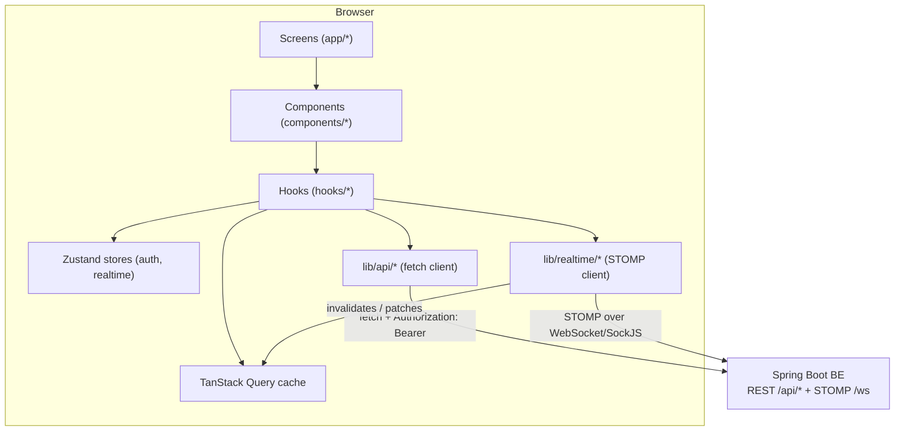
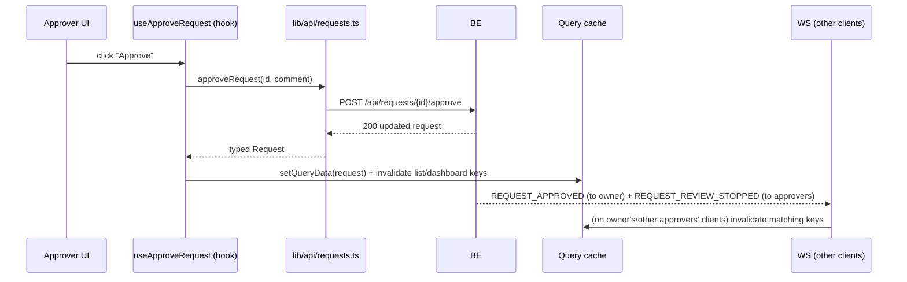

# 01 — System Architecture

## High-level diagram

## Layers

1. **Screens** (`app/**/page.tsx`) — route-level composition only: fetch nothing directly, delegate to hooks + components. Server components where there's no interactivity (e.g. static shell chrome); everything touching auth/query/WS is a client component.
2. **Components** (`components/**`) — presentational + light local state. Never call `fetch`/API functions directly — they receive data and callbacks from hooks via the screen.
3. **Hooks** (`hooks/**`) — the only layer allowed to call `lib/api/*` and read/write `lib/realtime/*` / Zustand stores. One hook per resource (`use-releases`, `use-request`, ...) plus cross-cutting hooks (`use-realtime`, `use-review-heartbeat`).
4. **API client** (`lib/api/**`) — typed wrappers around BE endpoints (BE §2–§7). Owns request/response shaping and error normalization; knows nothing about React.
5. **Realtime client** (`lib/realtime/**`) — STOMP/SockJS connection lifecycle, topic subscription management, reconnect/backfill orchestration (BE §8). Emits plain events; hooks decide what to do with them (usually: invalidate a query key).
6. **State**:
   - TanStack Query = server state (releases, requests, messages, notifications, dashboard). Source of truth is always a REST response.
   - Zustand = ephemeral client state that doesn't fit the request/response model: current auth session, live `reviewingBy` map keyed by `requestId`, WS connection status. See [06](06-state-management.md).
7. **Middleware** (`middleware.ts`) — coarse route protection (redirect to `/login` if no session cookie present). Does not validate the token — that's the BE's job on every request; middleware only prevents flashing protected UI to a logged-out visitor.

## Data flow for a typical mutation (approve a request)

The mutating client updates its own cache optimistically from the REST response (fast path); every *other* client learns about it only through the WS-triggered invalidation, then re-fetches from REST (BE §8 reliability rule 2 — WS is a hint, never the payload of record for anything beyond ephemeral presence).

## Non-goals (explicitly out of scope for this pass)

- FCM push for offline devices (BE §10a) — no FE work until BE ships it.
- In-browser file editor + version history (BE §10c) — file interaction is download-only (a single button), per the problem statement.
- Containerized execution + log streaming (BE §10b).

## Cross-cutting conventions

- **All dates** rendered relative ("2 min ago") with a title-attribute absolute timestamp; format with a single `lib/format-date.ts` helper, never inline.
- **All role/ownership checks** go through `lib/auth/capabilities.ts` (mirrors BE §9 matrix) — never inline `user.roles.includes(...)` in a component. FE checks are UX-only; BE re-enforces everything (BE §0, §9).
- **No optimistic status transitions** for request/release state — always wait for the REST response before showing the new status, since decisions are atomic/first-write-wins server-side (BE §1 rule 3) and a client-side guess could show state that then gets rejected with `409 REQUEST_ALREADY_DECIDED`.
